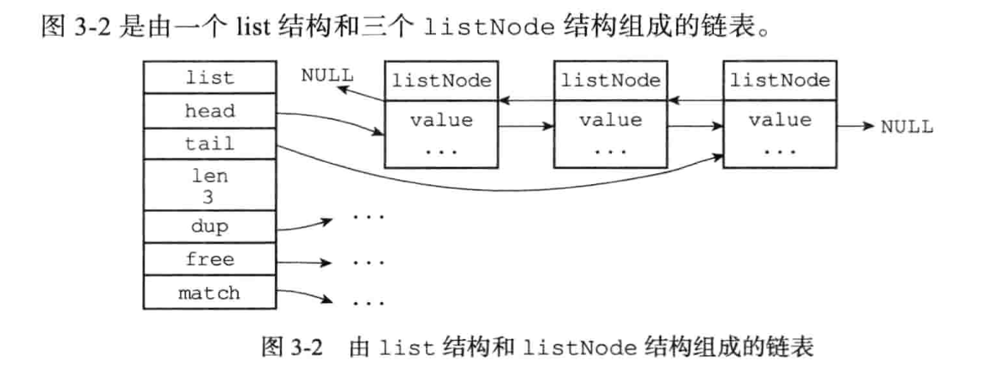

# 链表


```go
type node struct {
	//前置节点
	perv *node
	//后置节点
	next *node
	//节点的值
	value interface{}
}
```

```go
type list_node struct {
	// 表头节点
	head *node
	// 表尾节点
	tail *node
	//链表所包含的节点数量
	size int
  // 节点值复制函数
  dup func
  // 节点值释放函数
  free func
  // 节点值对比函数
  match func
}
```

```go
// dup 两数用于复制链表节点所保存的值;
// free 两数用于释放链表节点所保存的值;
// match 两数则用于对比链表节点所保存的值和另一个输人值是否相等
```




```go
//双端:链表节点带有prev 和next 指针，获取某个节点的前置节点和后置节点的 复杂度都是 0 (1)。

//无环:表头节点的prev 指针和表尾节点的next 指针都指向NULL，对链表的访 问以NULL 为终点。

//带表头指针和表尾指针:通过1ist 结构的head指针和tai1指针，程序获取链表的表头节点和表尾节点的复杂度为0 (1)

//带链表长度计数器:程序使用1ist结构的len属性来对list 持有的链表节点进行计数，程序获取链表中节点数量的复杂度为0(1)

//多态:链表节点使用void*指针来保存节点值，并且可以通过1ist 结构的dup、 free、match 三个属性为节点值设置类型特定两数，所以链表可以用于保存各种不 同类型的值。
```

### 重点回顾

```go
//链表被广泛用于实现Redis的各种功能，比如列表键、发布与订阅、慢查询、监视器等。
//每个链表节点由一个1istNode结构来表示，每个节点都有一个指向前置节点和后置节点的指针，所以Redis的链表实现是双端链表。

//每个链表使用一个Iist结构来表示，这个结构带有表头节点指针、表尾节点指针，以及链表长度等信息。

//因为链表表头节点的前置节点和表尾节点的后置节点都指向NULL，所以Redis的链表实现是无环链表。

//通过为链表设置不同的类型特定两数，Redis的链表可以用于保存各种不同类型的值。
```

