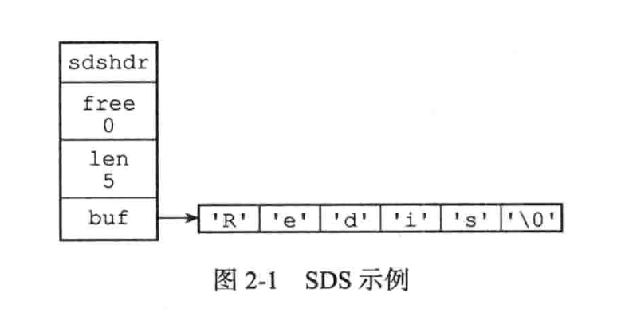

# SDS

### 示例

```go
redis>SET msg "hello world" 
ОК

//Redis在数据库中创建一个新的键值对时
//其中:
//键值对的键是 一个字符串对象，对象的底层实现是 一个保存着字符串"msg" 的SDS。
//键值对的值也是一个字符串对象，对象的底层实现是一个保存着字符串"hello world"的SDS
```

### SDS 定义



```go
type sdshdr struct{
	//记录buf 数组中的已使用的字节数量
  // 等于 sds 中所保存的字符串长度
  len int
  // 记录buf数组中未使用的字节数量
  free int
  // 字节数组，用于保存字符串
  buf []byte
}

//最后一个字节则保存了空字符，\0’
//len 的维护使得 获取字符串长度的时间复杂度为 O(1)
```

### 杜绝缓冲区溢出

```go
//C宇符串不记录自身长度带来的另 一个问题是容易造成缓冲区溢出
// 假如s1 分配足够适量的内存
// s1 修改增加字符串内容
// 但是s1 没有重新分配内存
// 直接修改导致的就是 有可能会修改到相邻地址的s2 字符串的内容
```

### 减少修改字符串时带来的内存重分配次数

```go
// 重新分配内存
// 扩充时 通过内存分配扩展底层数组的空间大小，没有则会造成缓冲区溢出
// 缩减时 通过内存分配来释放字符串中不在使用的部分空间，没有则会造成内存泄漏


//内存重分配涉及复杂的算法，并且可能需要执行系统调用，所以它通常是一个比较 耗时的操作

//在一般程序中，如果修改字符串长度的情况不太常出现，那么每次修改都执行 一次 内存重分配是可以接受的

//但是Redis作为数据库，经常被用于速度要求严苛、数据被频繁修改的场合，如果每次修改字符串的长度都需要执行一次内存重分配的话，那么光是执行内存重分配的时间就会占去修改字符串所用时间的一大部分，如果这种修改频繁地发生的话，可能还会对性能造成影响

//SDS 实现了空间预分配和惰性空间释放两种优化策略

//空间预分配用于优化SDS的宇符串增长操作:当SDS的API对一个SDS进行修改，并且需要对SDS进行空间扩展的时候，程序不仅会为SDS分配修改所必领要的空间，还会为SDS分配额外的未使用空间

//分配内存 数组扩充方式
//如果对SDS进行修改之后，SDS的长度(也即是1en属性的值)将小于1MB,那么程序分配和1en属性同样大小的未使用空间，这时SDS1en属性的值将和free属性的值相同。举个例子，如果进行修改之后，SDS的ien将变成13宇节，那么程序也会分配13字节的未使用空间，SDS的buf数组的实际长度将变成13+13+1=27字节(额外的一字节用于保存空字符)

//惰性空间释放用于优化SDS 的字符串缩短操作:当SDS 的 API 需要缩短SDS 保存的 字符串时，程序并不立即使用内存重分配来回收缩短后多出来的字节，而是使用free 属性 将这些字节的数量记录起来， 并等待将来使用
```

### 重点

```go
//Redis只会使用C字符串作为字面量，在大多数情况下，Redis使用SDS(SimpleDynamicString，简单动态字符串)作为宇符串表示。

//又比起C字符串，SDS具有以下优点:
1)常数复杂度获取字符串长度。
2)杜绝缓冲区溢出。
3)减少修改字符串长度时所需的内存重分配次数。
4)二进制安全。
5)兼容部分C字符串两数。
```

